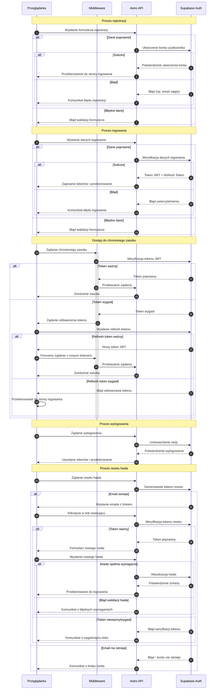

```mermaid
sequenceDiagram
    autonumber

    participant P as Przeglądarka
    participant M as Middleware
    participant A as Astro API
    participant S as Supabase Auth

    %% Rejestracja
    Note over P,S: Proces rejestracji
    P->>A: Wysłanie formularza rejestracji

    alt Dane poprawne
        A->>S: Utworzenie konta użytkownika
        alt Sukces
            S-->>A: Potwierdzenie utworzenia konta
            A-->>P: Przekierowanie do strony logowania
        else Błąd
            S-->>A: Błąd (np. email zajęty)
            A-->>P: Komunikat błędu rejestracji
        end
    else Błędne dane
        A-->>P: Błąd walidacji formularza
    end

    %% Logowanie
    Note over P,S: Proces logowania
    P->>A: Wysłanie danych logowania

    alt Dane poprawne
        A->>S: Weryfikacja danych logowania
        alt Sukces
            S-->>A: Token JWT + Refresh Token
            A-->>P: Zapisanie tokenów i przekierowanie
        else Błąd
            S-->>A: Błąd uwierzytelnienia
            A-->>P: Komunikat błędu logowania
        end
    else Błędne dane
        A-->>P: Błąd walidacji formularza
    end

    %% Dostęp do chronionego zasobu
    Note over P,S: Dostęp do chronionego zasobu
    P->>M: Żądanie chronionego zasobu
    activate M
    M->>S: Weryfikacja tokenu JWT

    alt Token ważny
        S-->>M: Token poprawny
        M->>A: Przekazanie żądania
        A-->>P: Zwrócenie zasobu
    else Token wygasł
        S-->>M: Token wygasł
        M-->>P: Żądanie odświeżenia tokenu
        P->>S: Wysłanie refresh tokenu
        alt Refresh token ważny
            S-->>P: Nowy token JWT
            P->>M: Ponowne żądanie z nowym tokenem
            M->>A: Przekazanie żądania
            A-->>P: Zwrócenie zasobu
        else Refresh token wygasł
            S-->>P: Błąd odświeżania tokenu
            P->>P: Przekierowanie do strony logowania
        end
    end
    deactivate M

    %% Wylogowanie
    Note over P,S: Proces wylogowania
    P->>A: Żądanie wylogowania
    A->>S: Unieważnienie sesji
    S-->>A: Potwierdzenie wylogowania
    A-->>P: Usunięcie tokenów i przekierowanie

    %% Reset hasła
    Note over P,S: Proces resetu hasła
    P->>A: Żądanie resetu hasła
    A->>S: Generowanie tokenu resetu
    alt Email istnieje
        S-->>P: Wysłanie emaila z linkiem
        P->>A: Kliknięcie w link resetujący
        A->>S: Weryfikacja tokenu resetu
        alt Token ważny
            S-->>A: Token poprawny
            A-->>P: Formularz nowego hasła
            P->>A: Wysłanie nowego hasła
            alt Hasło spełnia wymagania
                A->>S: Aktualizacja hasła
                S-->>A: Potwierdzenie zmiany
                A-->>P: Przekierowanie do logowania
            else Błąd walidacji hasła
                A-->>P: Komunikat o błędnych wymaganiach
            end
        else Token nieważny/wygasł
            S-->>A: Błąd weryfikacji tokenu
            A-->>P: Komunikat o wygaśnięciu linku
        end
    else Email nie istnieje
        S-->>A: Błąd - konto nie istnieje
        A-->>P: Komunikat o braku konta
    end
```
