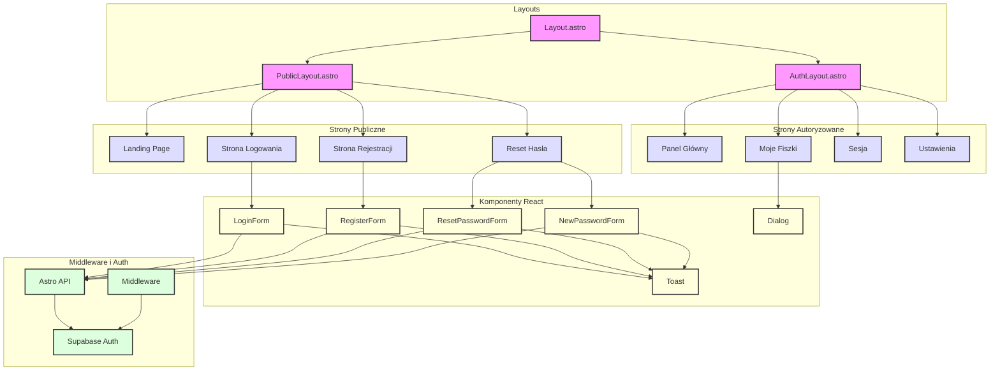

```mermaid
flowchart TD
subgraph "Layouts"
L["Layout.astro"]
AL["AuthLayout.astro"]
PL["PublicLayout.astro"]
end

    subgraph "Strony Publiczne"
        LP["Landing Page"]
        Login["Strona Logowania"]
        Register["Strona Rejestracji"]
        Reset["Reset Hasła"]
    end

    subgraph "Strony Autoryzowane"
        Dashboard["Panel Główny"]
        Flashcards["Moje Fiszki"]
        Session["Sesja"]
        Settings["Ustawienia"]
    end

    subgraph "Komponenty React"
        LF["LoginForm"]
        RF["RegisterForm"]
        RPF["ResetPasswordForm"]
        NPF["NewPasswordForm"]
        Toast["Toast"]
        Dialog["Dialog"]
    end

    subgraph "Middleware i Auth"
        M["Middleware"]
        SA["Supabase Auth"]
        API["Astro API"]
    end

    L --> AL & PL
    PL --> LP & Login & Register & Reset
    AL --> Dashboard & Flashcards & Session & Settings

    Login --> LF
    Register --> RF
    Reset --> RPF & NPF

    LF & RF & RPF & NPF --> API
    API --> SA
    M --> SA

    LF & RF & RPF & NPF --> Toast
    Flashcards --> Dialog

    classDef layout fill:#f9f,stroke:#333,stroke-width:2px
    classDef page fill:#ddf,stroke:#333,stroke-width:2px
    classDef component fill:#ffd,stroke:#333,stroke-width:2px
    classDef auth fill:#dfd,stroke:#333,stroke-width:2px

    class L,AL,PL layout
    class LP,Login,Register,Reset,Dashboard,Flashcards,Session,Settings page
    class LF,RF,RPF,NPF,Toast,Dialog component
    class M,SA,API auth
```
